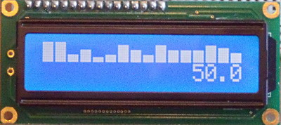

LcdHistogram
============

A simple LCD histogram library for Arduino inspired by [spark](https://github.com/holman/spark).

This library allows you to plot a set of data as a histogram on a LCD screen.  
For example, to draw the data set {1, 12, 3, 9, 10, 8, 0, 5}, it will show something like `▁█▂▆▇▅ ▄`.



## Usage
Just download and extract this repository in your [Arduino library](http://arduino.cc/en/Guide/Libraries) folder.  
LcdHistogram is a class allowing to print a graph on the screen.  
See the [docs/](docs) to know how to use it.

Example:
```c++
#include <LiquidCrystal.h>
#include <LcdHistogram.h>

void setup() {
	LiquidCrystal lcd(12, 11, 5, 4, 3, 2);
	lcd.begin(16, 2);
	
	// Create a new histogram
	LcdHistogram lhg(&lcd, 0, 0, 8);
	
	// Add some data
	lhg.push(1);
	lhg.push(12);
	lhg.push(3);
	lhg.push(9);
	lhg.push(10);
	lhg.push(8);
	lhg.push(0);
	lhg.push(5);
	
	// And display it
	lhg.plot();
}

void loop() {
}
```

## License
Copyright 2014 Pierre Faivre. This is free software, and may be redistributed under the terms specified in the LICENSE file.
